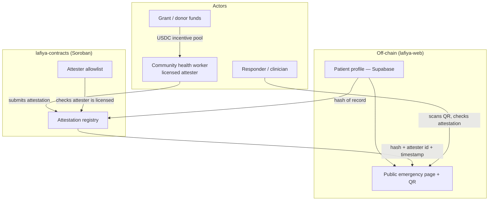

# Lafiya 🔏

[](https://stellar.org)
[](https://soroban.stellar.org)
[]()
[]()
[](https://github.com/Lafiya-xyz/Lafiya-contract/actions/workflows/ci.yml)
[](LICENSE)
[](https://Lafiya-xyz.github.io/Lafiya-contract/)

Soroban smart contracts for Lafiya's on-chain trust layer — an attestation registry and attester allowlist that let a health worker's verification of an emergency health record be checked cryptographically, without the underlying health data ever touching the blockchain.

**Your vitals, verified. When you can't speak, Lafiya does.**

*Lafiya* is Hausa for health, safety, and wellbeing.

> **Status:** Pre-alpha · Stellar **testnet** · not yet audited · not a medical device. See [Disclaimer](#disclaimer).

## Overview

🔗 Documentation: https://Lafiya-xyz.github.io/Lafiya-contract/
📖 Glossary: [docs/glossary.md](docs/glossary.md) — canonical definitions of core terms used across this repo (`attester`, `CHW`, `record hash`/`record commitment`, `schema version`, …)


Lafiya is a free, patient-owned emergency health card: the handful of facts that change how you are treated in an emergency — blood group, genotype, allergies, current medications, chronic conditions — travel with you as a scannable QR code and can be **cryptographically verified** by a health worker so a first responder can trust them on the spot.

This repository (`lafiya-contracts`) contains only the Soroban smart contract layer. The patient-facing web app and the docs/threat-model materials live in separate repos — see [Lafiya Organization](#lafiya-organization) below.

### The Problem

In Nigeria, health records are paper, siloed per facility, and effectively lost the moment a patient moves, is referred, or arrives unconscious. In an emergency, the facts that decide treatment — especially **genotype** (AS/SS sickle-cell status), blood group, and drug allergies — are usually unknown to whoever is treating you, and wrong assumptions cost lives.

Even once that data is digitized (in `lafiya-web`), a responder still has no way to know whether a card's contents were ever checked by a real health worker. Without an independent, tamper-evident verification layer:

- **Responders can't trust the data** — anyone could edit a public emergency page, so a "verified" label is meaningless unless it's backed by something the patient (or an attacker) can't forge
- **Health workers have no portable proof of their verification work** — nothing links a specific attester to a specific record across systems
- **Community health workers (CHWs) can't be paid reliably** for last-mile registration and verification without a transparent, low-fee settlement rail

### What `lafiya-contracts` Does

- **Attests** — records, on-chain, that a licensed health worker verified a specific patient record at a specific time, without storing any health data itself
- **Allowlists** — maintains the set of health workers authorized to submit attestations, so a "verified" indicator on a card actually means something
- **Anchors trust** — gives `lafiya-web` and `lafiya-verifier` a single, independently checkable source of truth that a responder's QR scan can query directly

## Features

- **Attestation registry (Soroban)** — when a licensed health worker verifies a record, an on-chain attestation stores *a hash of the record + the attester's identity + a timestamp* — never the health data itself
- **Attester allowlist** — only allowlisted attesters can write to the registry, so verification can't be forged by an arbitrary wallet
- **Hash-only on-chain footprint** — personal data lives in `lafiya-web`'s encrypted, access-controlled off-chain database; Stellar holds only hashes, attestations, and payments
- **USDC incentive rails** — CHWs are paid micro-amounts on Stellar per verified registration; near-zero fees and stablecoin settlement make last-mile outreach economically viable
- **Transparent funding** — grant and donor funds flow on-chain into the CHW incentive pool, so every dollar maps to a countable number of verified cards

## Architecture



### Core Components

- **`attester-registry`** — the on-chain allowlist of health workers authorized to write attestations
- **`attestation-registry`** — the on-chain record of which attester verified which record hash, and when; calls into `attester-registry` on every write
- **`multisig-account`** — a reusable N-of-M Soroban account contract that secures both registries' admin authorization. It deliberately ignores Soroban's authorization contexts in `__check_auth` — an accepted pre-alpha risk documented in [ADR-0007](docs/adr/0007-unscoped-multisig-authorization.md) — so a valid signer quorum's authority is not scoped to the registries

All three are implemented and unit-tested (target milestone **M1**, see [Roadmap](#roadmap)); none has been deployed to testnet yet.

## Smart Contract Layer

Three Soroban contracts, each in its own crate under `contracts/`.

**Design principle:** no personal health data ever touches the blockchain. Personal data lives in `lafiya-web`'s encrypted, access-controlled off-chain database. Stellar holds only hashes, attestations, and payments. This is what keeps Lafiya both privacy-respecting and regulator-compatible.

### `attester-registry`

| Function | Description |
| --- | --- |
| `initialize(admin: Address)` | Sets the admin. Callable once. |
| `get_admin() -> Address` | Returns the current admin address. |
| `propose_admin(new_admin: Address)` | Proposes a new admin. Requires admin auth. |
| `accept_admin()` | Finalizes the admin transfer. Requires proposed/pending admin auth. Emits `AdminTransferred`. |
| `add_attester(attester: Address)` | Allowlists `attester`. Requires admin auth. Blocked while paused (`Error::ContractPaused`). Emits `AttesterAdded`. |
| `add_attester_with_info(attester: Address, license_hash: Option<BytesN<32>>, region: Option<Symbol>)` | Allowlists `attester` with optional metadata. Requires admin auth. Blocked while paused (`Error::ContractPaused`). Emits `AttesterAdded`. |
| `update_attester_info(attester: Address, license_hash: Option<BytesN<32>>, region: Option<Symbol>)` | Updates metadata for an already-allowlisted `attester`. Requires admin auth. Blocked while paused (`Error::ContractPaused`). Fails with `Error::AttesterNotFound` if `attester` isn't currently allowlisted. Emits `AttesterInfoUpdated`, distinguishable from enrollment's `AttesterAdded`. |
| `remove_attester(attester: Address)` | Removes `attester` from the allowlist. Requires admin auth. Blocked while paused (`Error::ContractPaused`). Emits `AttesterRemoved`. |
| `is_attester(attester: Address) -> bool` | Whether `attester` is currently allowlisted (and not suspended). Open to any caller, including other contracts. Callable while paused. |
| `get_attester_info(attester: Address) -> Option<AttesterInfo>` | Returns stored metadata for an allowlisted attester. Callable while paused. |
| `get_attester_status(attester: Address) -> Option<AttesterStatus>` | Returns `attester`'s metadata together with its current suspension state in one call. `None` if `attester` isn't currently allowlisted (never added, or since removed). Callable while paused. |
| `suspend_attester(attester: Address)` | Suspends an allowlisted attester without removing it. Requires admin auth. Blocked while paused (`Error::ContractPaused`). Emits `AttesterSuspended`. |
| `reinstate_attester(attester: Address)` | Reinstates a suspended attester. Requires admin auth. Blocked while paused (`Error::ContractPaused`). Emits `AttesterReinstated`. |
| `set_max_attesters(max_attesters: u32)` | Sets the soft cap on the number of allowlisted attesters. Requires admin auth. Does not evict existing attesters if lowered below the current count. |
| `get_max_attesters() -> u32` | The current soft cap on the number of allowlisted attesters. |
| `get_attester_count() -> u32` | The current number of allowlisted attesters. |
| `pause()` | Blocks `add_attester`, `add_attester_with_info`, `remove_attester`, `suspend_attester`, and `reinstate_attester` until unpaused. Requires admin auth. Emits `Paused`. |
| `unpause()` | Restores normal operation after `pause`. Requires admin auth. Emits `Unpaused`. |
| `is_paused() -> bool` | Whether the contract is currently paused. Callable while paused. |
| `get_schema_version() -> u32` | Storage schema version recorded for the instance. Open to any caller. |
| `upgrade(new_wasm_hash: BytesN<32>)` | Replaces the contract's code with the already-uploaded wasm blob at `new_wasm_hash`. Requires admin auth; storage is untouched. See [Contract upgrades](#contract-upgrades). |
| `migrate()` | Runs any pending storage-schema migration, then records the new schema version. Requires admin auth; errors with `MigrationNotRequired` when nothing is pending. |

### `attestation-registry`

| Function | Description |
| --- | --- |
| `initialize(admin: Address, attester_registry: Address)` | Sets the admin and the `attester-registry` contract to consult. Callable once. |
| `get_admin() -> Address` | Returns the current admin address. |
| `get_attester_registry() -> Address` | Returns the configured `attester-registry` contract address. |
| `propose_admin(new_admin: Address)` | Proposes a new admin. Requires admin auth. |
| `accept_admin()` | Finalizes the admin transfer. Requires proposed/pending admin auth. Emits `AdminTransferred`. |
| `set_attester_registry(new_registry: Address)` | Repoints the `attester-registry` contract this registry consults for allowlist checks. Requires admin auth. Emits `AttesterRegistryRepointed`. |
| `pause()` | Blocks `attest` until unpaused. Requires admin auth. Emits `Paused`. |
| `unpause()` | Restores normal operation after `pause`. Requires admin auth. Emits `Unpaused`. |
| `is_paused() -> bool` | Whether the contract is currently paused. Callable while paused. |
| `attest(attester: Address, record_hash: BytesN<32>) -> Attestation` | Requires `attester`'s auth and that `attester` is allowlisted (checked via a cross-contract call to `attester-registry::is_attester`). Stores `{ attester, timestamp }` keyed by `record_hash`, keeping a bounded history per hash. Blocked while paused (`Error::ContractPaused`). Emits `AttestationRecorded`. |
| `revoke_attestation(record_hash: BytesN<32>)` | Revokes all attestations for `record_hash`. Requires admin auth. Emits `AttestationRevoked`. |
| `get_attestation(record_hash: BytesN<32>) -> Option<Attestation>` | Looks up the latest attestation for a record hash. Open to any caller — this is what lets a responder's QR scan verify a card without an external oracle. |
| `get_attestation_history(record_hash: BytesN<32>) -> Vec<Attestation>` | Returns the full bounded attestation history for a record hash, oldest first. Open to any caller. |

### Contract upgrades

`attester-registry` is upgradeable by its admin (`upgrade`/`migrate`/`get_schema_version`
above), with storage schema versioning (`SCHEMA_VERSION` starts at `1`) to make
schema-changing upgrades explicit and verifiable. `attestation-registry` does not
currently expose an `upgrade`/`migrate` path. **Operators** must follow
[docs/runbooks/contract-upgrade.md](docs/runbooks/contract-upgrade.md) — it covers the
pre-upgrade checklist, the `upgrade()` call sequence, verifying the wasm hash against
reviewed source, and `migrate()` handling for storage-schema-changing upgrades. The
mechanical steps are automated by [`scripts/upgrade.sh`](scripts/upgrade.sh).

### `multisig-account`

| Function | Description |
| --- | --- |
| `__constructor(signers: Vec<BytesN<32>>, threshold: u32)` | Configures the ed25519 signer set and required N-of-M threshold at deployment. |
| `__check_auth(...)` | Verifies ordered, unique signatures from configured signers whenever another contract calls `require_auth()` for this account address. |

`attestation-registry` calls `attester-registry` through a local `#[contractclient]` trait interface (just `is_attester`), not a direct crate dependency — depending on the whole crate would link `attester-registry`'s own contract implementation into `attestation-registry`'s wasm build too, which is both wasted size and, at least on the Soroban SDK version this repo pins, produces a linker warning from the two contracts' colliding `initialize` exports.

## Repository Structure

```
bindings/
├── attestation-registry/    # generated TS client for attestation contract
└── attester-registry/       # generated TS client for allowlist contract
contracts/
├── multisig-account/        # reusable N-of-M admin account
│   ├── Cargo.toml
│   └── src/
│       ├── lib.rs
│       ├── test.rs
│       └── integration_test.rs
├── attester-registry/       # allowlist contract
│   ├── Cargo.toml
│   └── src/
│       ├── lib.rs           # initialize, add_attester, remove_attester, is_attester, upgrade, migrate, get_schema_version
│       └── test.rs
└── attestation-registry/    # attestation contract
    ├── Cargo.toml
    └── src/
        ├── lib.rs           # initialize, attest, get_attestation, upgrade, migrate, get_schema_version
        └── test.rs
docs/
└── adr/                      # architecture decisions, index, and template
Cargo.toml                   # workspace + release profile
Cargo.lock                    # committed for reproducible builds
CHANGELOG.md                  # release notes incl. schema-impact statements
rust-toolchain.toml           # pins stable + wasm32v1-none
Makefile                      # build/test/fmt/clippy/wasm/bindings/check
.github/workflows/ci.yml      # runs the same checks on push/PR
LICENSE                       # MIT
CONTRIBUTING.md               # local dev workflow
```

## TypeScript Client Bindings

Client bindings are generated from the built WASM contracts using the `stellar-cli` tool. They allow frontend applications (like `lafiya-web`) to interact with the deployed contracts with full type safety.

### Generation

To generate the bindings, run:

```bash
make bindings
```

This builds the contracts and outputs TypeScript packages to the `bindings/` directory:
- `bindings/attester-registry`
- `bindings/attestation-registry`

To compile the generated packages:

```bash
cd bindings/attester-registry && npm install && npm run build
cd ../attestation-registry && npm install && npm run build
```

### Publishing & Consumption

The generated bindings are committed directly to this repository under the `bindings/` directory. `lafiya-web` (or any other consumer) can consume them via:
- Direct git path dependency in `package.json` pointing to the repo or subdirectory.
- A git submodule in the consuming project.

Publishing these directories as packages to the `@lafiya` npm organization is a planned, but
not yet implemented, secondary option. See [`PUBLISHING.md`](PUBLISHING.md) for the full
strategy and the follow-up work required before that's live.


## Tech Stack

- **On-chain:** Soroban smart contracts (Rust), `soroban-sdk` 25.x, on Stellar; USDC on Stellar for CHW payments
- **Network:** Stellar testnet first
- **Standards informing design:** W3C Verifiable Credentials data model (issuer/holder/verifier roles, hash-based attestation)

## Getting Started

```bash
git clone https://github.com/Lafiya-xyz/Lafiya-contract.git
cd Lafiya-contract
rustup target add wasm32v1-none   # also picked up automatically via rust-toolchain.toml
make check                        # fmt-check + clippy + test + wasm build
```

### Recommended admin setup

Deploy `multisig-account` first with the ed25519 public keys of all M administrators and the required threshold N. For example, three signer keys with a threshold of two creates a 2-of-3 admin account. Keep the signer keys in separate custody and order submitted signatures by public key.

Use the deployed multisig contract address as `admin` when initializing both registries:

```text
attester-registry.initialize(multisig_address)
attestation-registry.initialize(multisig_address, attester_registry_address)
```

The registry contracts need no multisig-specific logic. Their existing `admin.require_auth()` calls invoke the account contract's `__check_auth`, so an admin operation succeeds only when its authorization entry contains at least N valid signatures.

> **Authorization scope:** `multisig-account` is a general-purpose N-of-M account. It does not
> inspect Soroban's authorization contexts or restrict the contract, function, arguments, asset
> movement, or nested invocations that a valid quorum may approve. It is not a
> registry-scoped or least-privileged account.

For pre-alpha use, assign a signer set dedicated exclusively to Lafiya registry administration;
do not reuse those keys or that quorum for treasury or unrelated authority. Do not use the
multisig address as a treasury: keep only the bounded XLM fee reserve recorded for the deployment
and sweep any excess. Before signing, each signer must inspect the decoded authorization tree
and independently verify the registry address, function, arguments, asset movements, and
sub-invocations. A payload hash or transaction label alone is not sufficient.

The deployment record must contain the signer-set identifier (never secret keys), threshold,
approved registry addresses, fee-reserve ceiling, and balance-sweep and authorization-review
procedures. This account must not administer a production or mainnet deployment until its
unscoped authority is explicitly accepted for that environment or replaced by an on-chain
scoping policy. See
[ADR-0007](docs/adr/0007-unscoped-multisig-authorization.md) for the decision and residual risks.

Not yet deployed to testnet — deployment scripts and instructions land with the rest of milestone M1.

## Privacy & Compliance

- **Nigeria Data Protection Act (2023)** governs all personal data held across the Lafiya project. Consent, encryption, and minimal disclosure are designed in from day one.
- No health data is ever written on-chain — only non-reversible hashes and attestations, by design (see [Smart Contract Layer](#smart-contract-layer)).

## Roadmap

- **M0 — Public card (testnet).** One patient can create a profile and expose a working read-only emergency page via QR. *(`lafiya-web`)*
- **M1 — Attestation.** Soroban registry lets an allowlisted attester verify a record; the card shows a verified indicator. **← this repo** — contracts implemented and unit-tested; testnet deployment and `lafiya-web` integration still open.
- **M2 — Incentives.** USDC-on-Stellar payout to a CHW per verified registration. Target
  custody architecture (separate treasury from registry admin, bounded payout contract)
  specified in [ADR-0009](docs/adr/0009-treasury-asset-custody-model.md); no payment
  contract implemented yet.
- **M3 — Pilot.** Small supervised field pilot; measure verified cards created and scan events.
- **M4 — Mainnet + funding.** Launch on mainnet; open transparent funding pool.

## Why This Matters for the Stellar Ecosystem

Stellar/Soroban does two things Lafiya genuinely needs that a plain web app cannot: it makes verification **tamper-evident and independently checkable** without exposing data, and it moves **stablecoin micropayments** to health workers cheaply and across borders. Remove Stellar and the trust layer and the incentive engine both disappear — Soroban is core to Lafiya, not shoehorned in.

## Testing

```bash
make test              # Unit tests (in-process soroban-sdk testutils)
make test-integration  # Integration tests (deployed WASMs on local Soroban network)
```

Covers, per contract (see `contracts/*/src/test.rs` and `tests/integration/run.sh`):

- ✅ Initialize / double-initialize rejection
- ✅ Admin-gated writes (`add_attester`, `remove_attester`), including rejection when the caller's auth entry doesn't match
- ✅ Allowlist lookups (`is_attester`)
- ✅ `attest` by an allowlisted vs. non-allowlisted attester, and before the contract is initialized
- ✅ `get_attestation` lookups, including unknown hashes and re-attestation overwrite
- ✅ Emitted events (`AttesterAdded`, `AttesterRemoved`, `AttestationRecorded`)
- ✅ Multisig threshold, signer validation, signature ordering, and invalid-signature rejection
- ✅ Multisig-backed initialization and admin operations through the contract-account authorization path


## Dependencies

- Rust (stable) + `wasm32v1-none` target — see `rust-toolchain.toml`
- `soroban-sdk` 25.x
- Stellar testnet account and USDC trustline, once deployment scripts land

## License

[MIT](LICENSE).

## Contributing

Contributions are welcome! As an open-source Digital Public Good, we rely on community contributions to build and maintain Lafiya.

Please refer to [CONTRIBUTING.md](CONTRIBUTING.md) for our detailed guidelines, which cover:
- Local development environment setup
- Branching and commit conventions (Conventional Commits)
- Cross-repo shared-contract coordination guidelines
- Database/Supabase migration details
- Smart contract quality standards and testing checklist

This repository specifically needs collaborators with experience in:
- Stellar / Soroban smart contract development (Rust)
- On-chain data modeling and attestation/verifiable-credential design

## Lafiya Organization

This repo is one of five in the `lafiya-xyz` organization.

| Repo                  | URL | Purpose                                                                                              | Priority                 |
| ---------------------- | --- | ----------------------------------------------------------------------------------------------------- | ------------------------- |
| `lafiya-web`           | [github.com/Lafiya-xyz/lafiya-web](https://github.com/Lafiya-xyz/lafiya-web) | Patient + responder web app (Next.js). Public emergency page, authed profile editor, QR generation.    | Build first               |
| **`lafiya-contracts`** _(this repo)_ | [github.com/Lafiya-xyz/Lafiya-contract](https://github.com/Lafiya-xyz/Lafiya-contract) | Soroban smart contracts (Rust): attestation registry + attester allowlist. Testnet first. | **Build next**            |
| `lafiya-docs`          | [github.com/Lafiya-xyz/lafiya-docs](https://github.com/Lafiya-xyz/lafiya-docs) | Concept note, data model, threat model, privacy design, funding/DPG materials, references.             | Start now (lightweight)   |
| `.github`              | [github.com/Lafiya-xyz/.github](https://github.com/Lafiya-xyz/.github) | Organization profile README and contribution guidelines.                                               | Start now                 |
| `lafiya-verifier`      | [github.com/Lafiya-xyz/lafiya-verifier](https://github.com/Lafiya-xyz/lafiya-verifier) | CHW verification tool. Begins as a route inside `lafiya-web`; split out only if it grows.               | Later                     |

> Resist scaffolding empty repos. Two working repos (`lafiya-web`, `lafiya-contracts`) beat five half-built ones. Build one honest milestone at a time.

### Data Flow

```
lafiya-web  ──(record hash)──▶  lafiya-contracts
                                       │
        CHW attests ──(licensed?)──▶  │  (attester allowlist check)
                                       ▼
                          attestation: hash + attester id + timestamp
                                       │
                                       ▼
                              lafiya-web public emergency page
                                       │
                                       ▼
                         responder scans QR, sees verified indicator
```

1. **`lafiya-web`** holds the patient's private profile and computes a hash of the emergency-relevant record.
2. A licensed CHW, verified against the **attester allowlist**, submits an attestation to the **attestation registry** in this repo — a hash, the attester's identity, and a timestamp, never the health data itself.
3. **`lafiya-web`**'s public emergency page reads the attestation to show a verified indicator; a responder scanning the QR can independently trust it without an external oracle.
4. **`lafiya-verifier`** (later) gives CHWs a dedicated flow for step 2 as it splits out of `lafiya-web`.

### Shared Contracts (must stay in sync across repos)

**Attestation schema** — a hash of the record + the attester's identity + a timestamp, defined by the contracts in this repo and consumed by `lafiya-web`'s public emergency page. If the shape of an attestation changes here, `lafiya-web`'s verification-display logic must be updated in the same change set (or a tracked follow-up opened there).

The verification read calls, caching rules, display specification, error-to-UX mapping, and PR conformance checklist for `lafiya-web` are defined in [docs/integration/lafiya-web.md](docs/integration/lafiya-web.md).

### Conventions for AI Agents

- Treat this section as the source of truth for **cross-repo** contracts. Each repo's own README covers repo-local conventions.
- The contracts are implemented and unit-tested but not yet deployed to testnet — don't assume a live contract ID or deployment scripts exist; check [Repository Structure](#repository-structure) before referencing a path.
- When a change here affects the attestation schema or either contract's function signatures, call it out explicitly so `lafiya-web` can be updated to match.

## Support

For issues and questions:

- GitHub Issues: [Create an issue](https://github.com/Lafiya-xyz/Lafiya-contract/issues)

## Disclaimer

Lafiya is an information aid, **not a medical device** and **not a substitute for professional medical judgment**. Verified indicators reflect that a record was attested by a registered health worker; they are not a clinical guarantee. Treatment decisions remain the responsibility of the attending clinician.

## Security

Found a vulnerability? Please don't open a public issue — see [SECURITY.md](SECURITY.md) for how to report it privately.

## References

These works directly informed Lafiya's design and are the intended reading for contributors, particularly the attestation/trust-layer work in this repo.

**Books**

- Preukschat, A., & Reed, D. (2021). *Self-Sovereign Identity: Decentralized Digital Identity and Verifiable Credentials*. Manning. — The blueprint for Lafiya's attestation layer: issuer/holder/verifier roles, verifiable credentials, hash-based attestation, key management, and offline verification.
- Kleppmann, M. (2017). *Designing Data-Intensive Applications*. O'Reilly. — Informs the boundary between what lives in the off-chain database and what is anchored on-chain.
- Martin, R. C. (2017). *Clean Architecture: A Craftsman's Guide to Software Structure and Design*. Prentice Hall. — Discipline for an AI-assisted codebase: clear boundaries so the contracts, app, and data layer stay independently maintainable.
- Shortliffe, E. H., & Cimino, J. J. (Eds.). (2021). *Biomedical Informatics: Computer Applications in Health Care and Biomedicine* (5th ed.). Springer. — Grounds which fields are decision-relevant in an emergency, informing what a record hash here actually represents.
- Toyama, K. (2015). *Geek Heresy: Rescuing Social Change from the Cult of Technology*. PublicAffairs. — Keeps the project honest: the attestation layer amplifies trust in community health workers rather than replacing them.

**Standards & documentation**

- Stellar Development Foundation — Stellar and Soroban developer documentation.
- W3C — Verifiable Credentials Data Model.
- Nigeria Data Protection Act (2023) — Nigeria Data Protection Commission.
- Digital Public Goods Alliance — DPG Standard.

---

<div align="center">

**Lafiya** — Your vitals, verified.

_Built for the Stellar ecosystem. Open source. Community owned._

</div>
