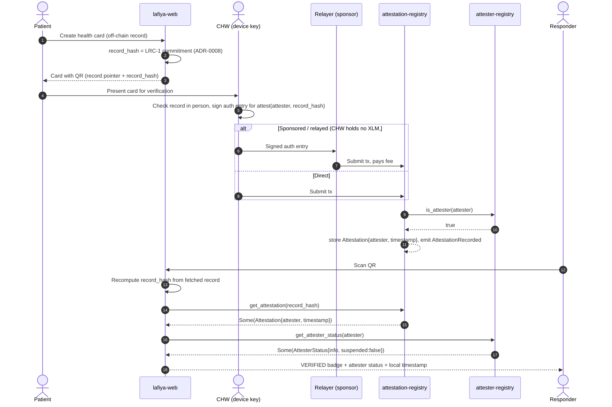
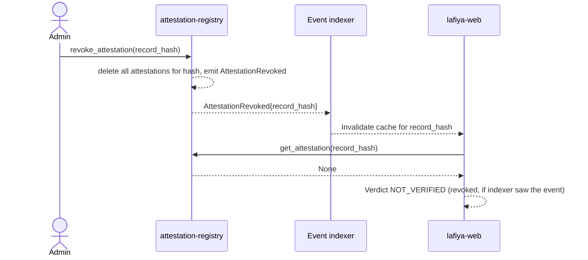
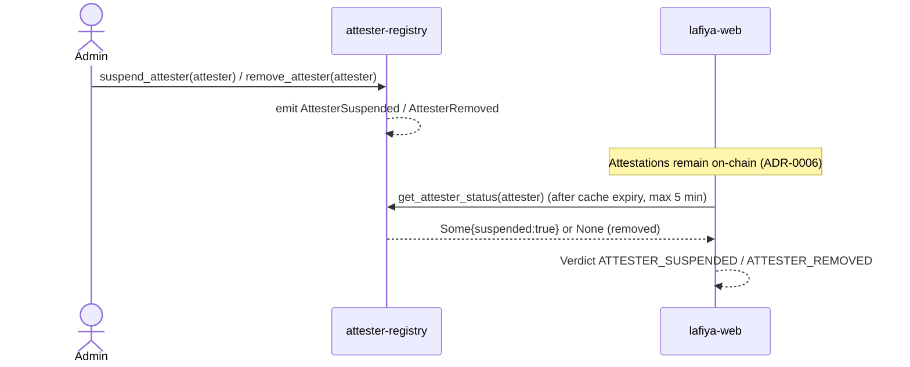
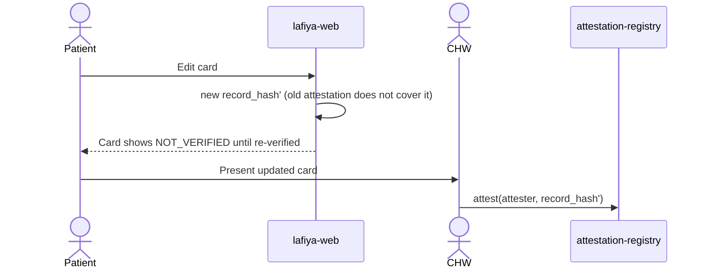

# lafiya-web Integration Guide: Verification Display Contract

This is the single normative specification for how `lafiya-web` reads, caches,
and **displays** Lafiya attestations. A mistake here becomes a wrong "verified"
badge in front of an emergency responder, so the rules are strict.

Related decisions: [ADR-0001](../adr/0001-hash-only-on-chain-footprint.md)
(hash-only footprint), [ADR-0006](../adr/0006-attestation-revocation-semantics.md)
(revocation semantics and display obligations),
[ADR-0008](../adr/0008-record-commitment-canonicalization.md) (record hash),
[ADR-0010](../adr/0010-release-manifest-and-compatibility.md) (release manifest),
[ADR-0011](../adr/0011-rpc-provider-failover-and-transaction-recovery.md) (RPC
failure taxonomy), [ADR-0012](../adr/0012-chw-attester-key-custody.md) (CHW keys).

The words MUST, MUST NOT, and SHOULD are used as in RFC 2119.

## 1. Flows

### Patient creates a card → CHW verifies → responder scans

### Revocation

### Attester suspension and removal

### Card update

## 2. Read calls, order, and caching

A verifier MUST perform these reads, in this order, for every scan:

| # | Call | Contract | Purpose |
| --- | --- | --- | --- |
| 1 | Recompute `record_hash` locally from the fetched record (ADR-0008) | n/a | Never trust a hash printed on the card alone |
| 2 | `get_attestation(record_hash) -> Option<Attestation>` | attestation-registry | Latest attestation `{attester, timestamp}` |
| 3 | `get_attester_status(attestation.attester) -> Option<AttesterStatus>` | attester-registry | Current status: `Some{suspended:false}` active, `Some{suspended:true}` suspended, `None` removed |
| 4 (optional) | `get_attestation_history(record_hash)` | attestation-registry | Audit view only; never used to compute the verdict |

Reads are simulation-only (`simulateTransaction`) and need no signature or fee.
Step 3 MUST NOT be skipped, even if step 2 is served from cache.

### Caching rules

| Data | Max cache age | Invalidation |
| --- | --- | --- |
| Attester status (step 3) | **5 minutes** | `AttesterSuspended`, `AttesterReinstated`, `AttesterRemoved`, `AttesterAdded` events for that address |
| Attestation (step 2), when `Some` | Until revoked, and at most **24 hours** as a safety net | `AttestationRevoked` or `AttestationRecorded` for that `record_hash` |
| Attestation, when `None` | **Not cached** | n/a |
| A failed read | **Never cached** | n/a |

**Detecting revocation:** `revoke_attestation` deletes the attestation, so
`get_attestation` returns `None`, which cannot be told apart from "never
attested" on-chain. Revocation is detected from the `AttestationRevoked` event
(see [event indexing](../architecture/event-indexing.md) and
[events.md](../events.md)). A cache entry MUST be dropped when that event is
seen for its `record_hash`.

## 3. Display specification

The verdict is computed only from steps 2 and 3, and only when both succeeded.

| Verdict | Condition | Meaning | Badge | Required text | Required elements |
| --- | --- | --- | --- | --- | --- |
| `VERIFIED` | Attestation `Some`, status `Some{suspended:false}` | A currently active CHW verified this exact record | Green | "Verified by a community health worker" | Attester current status "Active"; attestation time in the **responder's local time zone** with offset; attester display name from off-chain metadata if available |
| `ATTESTER_SUSPENDED` | Attestation `Some`, status `Some{suspended:true}` | Record was verified, but the verifying CHW is currently suspended | Amber | "Verified by a health worker who is currently suspended. Treat with caution." | Status "Suspended"; local timestamp |
| `ATTESTER_REMOVED` | Attestation `Some`, status `None` | Verifying CHW is no longer on the allowlist | Amber | "Verified by a health worker who is no longer authorised. Treat with caution." | Status "Removed"; local timestamp |
| `NOT_VERIFIED` | Attestation `None` | No current attestation: never verified, revoked, or card edited since | Grey | "Not verified" (plus "Verification was revoked" when the indexer has seen `AttestationRevoked`) | None |
| `UNAVAILABLE` | Any read failed or timed out, or record hash could not be recomputed | Verification status unknown | Grey, with a warning icon | "Verification could not be checked" | Retry control; error message from section 4 |

### Forbidden renderings

A `lafiya-web` build MUST NOT:

- show `VERIFIED` (or any green badge) when the attester status lookup failed,
  timed out, or was skipped;
- show `VERIFIED` from a cached attestation older than the limits in section 2;
- show a green badge for `ATTESTER_SUSPENDED` or `ATTESTER_REMOVED`;
- render `UNAVAILABLE` as `NOT_VERIFIED`, or the reverse; an outage is not a
  negative verdict;
- show the timestamp in UTC only, or without a time-zone indicator;
- show the attester's raw address as the primary identity to a responder;
- show any health data sourced from on-chain state (there is none; ADR-0001).

## 4. Error-to-UX mapping

Translation keys follow `verification.error.<source>.<identifier>`, in
lower-kebab-case (for example `verification.error.attestation-registry.contract-paused`).
All English strings below are the default `en` values.

### Contract errors

This table is checked against [docs/error-codes.md](../error-codes.md) by
`scripts/conformance/check_web_error_mapping.py` in CI; every error of both
registries must appear here with the same code and name.

| Contract | Code | Variant | Verdict | User-facing message (en) | Remediation |
| --- | --- | --- | --- | --- | --- |
| `attester-registry` | `1` | `NotInitialized` | `UNAVAILABLE` | "Verification service is not set up on this network." | Check the configured contract IDs against the release manifest |
| `attester-registry` | `2` | `AlreadyInitialized` | n/a (admin only) | "This registry is already set up." | None for responders |
| `attester-registry` | `3` | `NoPendingTransfer` | n/a (admin only) | "No administrator handover is pending." | Admin tooling only |
| `attester-registry` | `4` | `ContractPaused` | `UNAVAILABLE` for writes; reads still work | "Verification changes are temporarily paused." | Retry later |
| `attester-registry` | `5` | `AllowlistFull` | n/a (admin only) | "The health worker list is full." | Admin raises the cap |
| `attester-registry` | `6` | `MigrationNotRequired` | n/a (admin only) | "No upgrade is needed." | None |
| `attester-registry` | `7` | `AttesterNotFound` | n/a (admin only) | "That health worker is not registered." | Admin re-checks the address |
| `attester-registry` | `8` | `BatchTooLarge` | n/a (admin only) | "Too many health workers in one request." | Split the batch |
| `attestation-registry` | `1` | `NotInitialized` | `UNAVAILABLE` | "Verification service is not set up on this network." | Check the configured contract IDs |
| `attestation-registry` | `2` | `AlreadyInitialized` | n/a (admin only) | "This registry is already set up." | None |
| `attestation-registry` | `3` | `AttesterNotAllowlisted` | n/a (CHW flow) | "You are not currently authorised to verify records." | CHW contacts the supervisor |
| `attestation-registry` | `4` | `NoPendingTransfer` | n/a (admin only) | "No administrator handover is pending." | Admin tooling only |
| `attestation-registry` | `5` | `InvalidRegistryWiring` | `UNAVAILABLE` | "Verification service is misconfigured." | Maintainers fix the registry wiring |
| `attestation-registry` | `6` | `AttestationNotFound` | `NOT_VERIFIED` | "Not verified." | Ask a CHW to verify the card |
| `attestation-registry` | `7` | `ContractPaused` | CHW flow blocked; reads still work | "Verification is temporarily paused. Try again later." | Retry later |

### RPC failure classes (ADR-0011)

| Class | Verdict | Message (en) | Key | Remediation |
| --- | --- | --- | --- | --- |
| Safe to retry (nothing sent) | `UNAVAILABLE` | "Could not reach the verification network. Retrying…" | `verification.error.rpc.safe-to-retry` | Automatic failover to the next provider, then a manual retry control |
| Must poll first (ambiguous, CHW writes only) | Pending | "Submitting… do not verify again yet." | `verification.error.rpc.must-poll-first` | Poll the transaction hash; never resubmit blindly |
| Do not retry (final `Rejected`) | n/a | "Verification was rejected by the network." | `verification.error.rpc.rejected` | Show the contract error above if one is present |
| No retry needed (final `Accepted`) | n/a | "Verification recorded." | `verification.success.recorded` | None |

### SDK errors (`@stellar/stellar-sdk` contract client)

| SDK error | Verdict | Message (en) | Key | Remediation |
| --- | --- | --- | --- | --- |
| `SimulationFailed` | `UNAVAILABLE` (reads) | "Verification could not be checked." | `verification.error.sdk.simulation-failed` | Retry; if it persists, check contract IDs |
| `ExpiredState` / `RestorationFailure` | `UNAVAILABLE` | "This record's verification data needs to be restored." | `verification.error.sdk.expired-state` | Operator restores the archived entry |
| `NeedsMoreSignatures` / `NoSigner` | n/a (CHW flow) | "Your device key could not sign." | `verification.error.sdk.no-signer` | Re-unlock the device key; see the custody policy |
| `UserRejected` | n/a (CHW flow) | "Verification cancelled." | `verification.error.sdk.user-rejected` | None |
| `ExternalServiceError` | `UNAVAILABLE` | "Verification service unavailable." | `verification.error.sdk.external-service` | Retry later |
| Record hash mismatch (local) | `UNAVAILABLE` | "The card data could not be read correctly." | `verification.error.local.hash-mismatch` | Rescan; report if persistent |

## 5. Change management

- Every release publishes a **release manifest** (ADR-0010) listing contract
  IDs, interface versions, storage schema versions, and events.
- `lafiya-web` owns a `lafiya-web.requirements.json` (example:
  [docs/release-manifest/examples/lafiya-web.requirements.json](../release-manifest/examples/lafiya-web.requirements.json))
  and runs `scripts/check_manifest_compatibility.py` against each new manifest
  in **its own CI**. An incompatible manifest fails `lafiya-web` CI before any
  upgrade.
- Contract IDs MUST be loaded from the release manifest or `config/networks.toml`,
  never hard-coded; see [testnet-reset.md](../runbooks/testnet-reset.md).
- Any change here to the attestation schema, these read calls, the error enums,
  or the events MUST update this guide in the same PR and be called out for
  `lafiya-web` (README "Shared Contracts").

## 6. Conformance checklist for lafiya-web PRs

Copy into every `lafiya-web` PR that touches verification:

- [ ] `record_hash` is recomputed locally (ADR-0008); the card's printed hash is not trusted alone.
- [ ] Reads happen in order: `get_attestation`, then `get_attester_status`, for every scan.
- [ ] Attester status is cached for at most 5 minutes; failed reads and `None` attestations are never cached.
- [ ] `AttestationRevoked` invalidates the cached attestation.
- [ ] All five verdicts render exactly as in section 3, including current attester status and a local timestamp with time zone.
- [ ] No forbidden rendering from section 3 is reachable (tests cover a failed status lookup → `UNAVAILABLE`).
- [ ] Every contract, RPC, and SDK error in section 4 maps to its translation key.
- [ ] Contract IDs come from the release manifest or config, not constants.
- [ ] The manifest compatibility check passes in CI.
